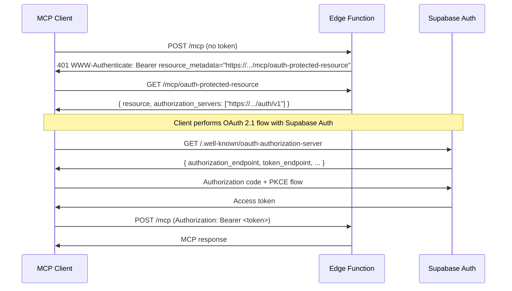

# @supabase/mcp-server-edge

MCP protocol middleware for Supabase Edge Functions. Handles OAuth discovery, `WWW-Authenticate` headers, and method routing so you can focus on your tools.

Pairs with [`@supabase/server`](https://github.com/supabase/server) for auth and Supabase client access. Bring your own MCP library (e.g. [`@modelcontextprotocol/sdk`](https://github.com/modelcontextprotocol/typescript-sdk)).

## Quick start

_supabase/functions/mcp/index.ts_

```typescript
import { withMcp } from 'npm:@supabase/mcp-server-edge';
import { withSupabase } from 'npm:@supabase/server';
import { McpServer } from 'npm:@modelcontextprotocol/sdk/server/mcp.js';
import { WebStandardStreamableHTTPServerTransport } from 'npm:@modelcontextprotocol/sdk/server/webStandardStreamableHttp.js';
import * as z from 'npm:zod/v4';

Deno.serve(
  withMcp(
    withSupabase({ auth: 'user' }, async (req, { supabase }) => {
      const server = new McpServer({ name: 'my-mcp', version: '0.1.0' });

      server.registerTool(
        'get_todos',
        {
          description: 'List todos belonging to the current user',
          inputSchema: z.object({ limit: z.number().optional().default(20) }),
        },
        async ({ limit }) => {
          const { data, error } = await supabase
            .from('todos')
            .select('id, title, body')
            .limit(limit);

          if (error) throw new Error(error.message);
          return { content: [{ type: 'text', text: JSON.stringify(data) }] };
        },
      );

      const transport = new WebStandardStreamableHTTPServerTransport();
      await server.connect(transport);
      return transport.handleRequest(req);
    }),
  ),
);
```

Deploy with `supabase functions deploy mcp`. The function can be named anything - `mcp` is just a convention.

## Compatibility

Implements the [MCP specification](https://modelcontextprotocol.io/specification/2025-03-26) (Streamable HTTP transport). Confirmed working with:

- [Claude Code](https://claude.ai/code)
- [Claude.ai](https://claude.ai) (web + desktop, via the MCP connector)
- [Cursor](https://cursor.com)
- [VS Code](https://code.visualstudio.com)

Any spec-compliant MCP client should work.

## How it works

### Layers

```
withMcp          — MCP protocol (RFC 9728, 401 enrichment, method routing)
  withSupabase   — auth + Supabase clients (@supabase/server)
    your handler — build your McpServer, wire the transport, return a Response
```

**`withMcp`** handles the MCP-specific protocol layer:

| Route                                | Action                                                            |
| ------------------------------------ | ----------------------------------------------------------------- |
| `GET /{fn}/oauth-protected-resource` | RFC 9728 OAuth Protected Resource Metadata                        |
| `GET /{fn}` or `DELETE /{fn}`        | 405 Method Not Allowed (stateless - no SSE or session management) |
| Any other method on `/{fn}`          | Passed through to your handler                                    |
| Inner handler returns 401            | `WWW-Authenticate: Bearer resource_metadata="..."` header added   |
| Any other path                       | 404                                                               |

The function name is inferred from the first path segment automatically. URLs are reconstructed from `X-Forwarded-*` headers so the correct public-facing URL appears in OAuth metadata regardless of whether the function is running locally or on hosted Supabase.

**`withSupabase`** (from `@supabase/server`) handles auth and client creation. On Edge Functions, `SUPABASE_JWKS`, `SUPABASE_PUBLISHABLE_KEYS`, and `SUPABASE_SECRET_KEYS` are auto-injected - no configuration needed.

### Auth

Supabase Auth ships a built-in OAuth 2.1 authorization server. To use it with MCP you need to:

1. **Enable the OAuth 2.1 server** - follow the [getting started guide](https://supabase.com/docs/guides/auth/oauth-server/getting-started)
2. **Enable asymmetric JWT signing** - OAuth 2.1 requires RS256 or ES256 signed tokens. Enable this in [Auth signing keys settings](https://supabase.com/docs/guides/auth/signing-keys)
3. **Enable dynamic client registration** - MCP clients register themselves before starting an OAuth flow. Enable this in the Auth settings

Once that's in place, `withMcp` + `withSupabase` handle the rest:



> **Note:** The metadata endpoint lives at `/{fn}/oauth-protected-resource` rather than `/.well-known/oauth-protected-resource` because `/.well-known/` sits at the root of your Supabase project domain, not inside your edge function. This is fully supported by [RFC 9728 Section 5](https://datatracker.ietf.org/doc/html/rfc9728#section-5) - the `WWW-Authenticate` header tells clients exactly where to find the metadata, so they never need to guess.

## Composability

`withMcp` accepts any `(req: Request) => Promise<Response>` handler - it doesn't know or care what's inside. Swap auth layers or MCP libraries without changing the outer wrapper.

### Without `@supabase/server`

```typescript
// no auth - open endpoint
Deno.serve(
  withMcp(async (req) => {
    const server = new McpServer({ name: 'my-mcp', version: '0.1.0' });
    // ... register tools ...
    const transport = new WebStandardStreamableHTTPServerTransport();
    await server.connect(transport);
    return transport.handleRequest(req);
  }),
);
```

### With a different MCP library

This example uses [mcp-lite](https://github.com/fiberplane/mcp-lite) - the transport lines change but `withMcp` and `withSupabase` are identical:

```typescript
import { McpServer, StreamableHttpTransport } from 'npm:mcp-lite';
import { z } from 'npm:zod';

Deno.serve(
  withMcp(
    withSupabase({ auth: 'user' }, async (req, { supabase }) => {
      const server = new McpServer({
        name: 'my-mcp',
        version: '0.1.0',
        schemaAdapter: (schema) => z.toJSONSchema(schema as z.ZodType),
      });

      server.tool('get_todos', {
        description: 'List todos belonging to the current user',
        inputSchema: z.object({ limit: z.number().optional().default(20) }),
        handler: async ({ limit }) => {
          const { data, error } = await supabase
            .from('todos')
            .select('id, title, body')
            .limit(limit);
          if (error) throw new Error(error.message);
          return { content: [{ type: 'text', text: JSON.stringify(data) }] };
        },
      });

      const transport = new StreamableHttpTransport();
      return transport.bind(server)(req);
    }),
  ),
);
```

## Escape hatches

For custom routing or non-standard setups, use the standalone functions directly.

### `unauthorizedResponse(req, options?)`

Returns a `401` with a `WWW-Authenticate` header pointing to the metadata endpoint. URL auto-constructed from `X-Forwarded-*` headers.

```typescript
import { unauthorizedResponse } from 'npm:@supabase/mcp-server-edge';

unauthorizedResponse(req);
// or override the URL
unauthorizedResponse(req, {
  resourceMetadataUrl:
    'https://my-custom-domain.com/.well-known/oauth-protected-resource',
});
```

### `resourceMetadataResponse(req, options?)`

Returns a `200` RFC 9728 OAuth Protected Resource Metadata response. Auto-constructs `resource` and `authorization_servers` from `X-Forwarded-*` headers.

```typescript
import { resourceMetadataResponse } from 'npm:@supabase/mcp-server-edge';

resourceMetadataResponse(req);
// or override
resourceMetadataResponse(req, {
  resource: 'https://my-custom-domain.com/.well-known/oauth-protected-resource',
  authorizationServers: [
    'https://my-custom-domain.com/.well-known/oauth-authorization-server',
  ],
});
```

## Limitations

Edge functions are stateless - there is no persistent connection between requests. This SDK uses Streamable HTTP in its simplest form: one POST in, one response out, no server-initiated streams. This rules out two MCP features:

- **Elicitations** - the server asking the client for additional user input mid-request. Not supported in stateless HTTP operation per the [MCP spec](https://modelcontextprotocol.io/specification/2025-03-26).
- **Sampling** - the server asking the client to run an LLM completion. Requires an open channel from server to client.
