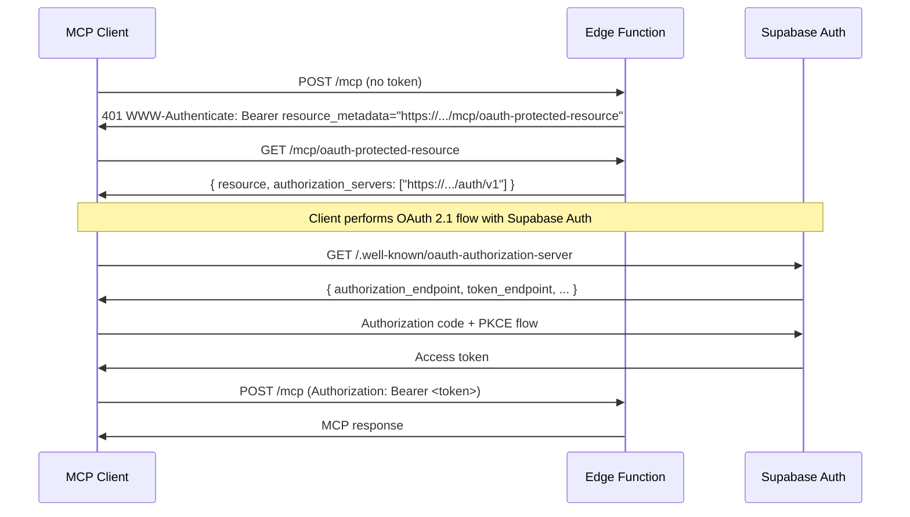

# @supabase/mcp-server-edge

Expose your Supabase app to AI assistants via [Model Context Protocol](https://modelcontextprotocol.io) (MCP) - or build a new MCP server from scratch. Auth and Row Level Security are handled automatically, so you write tools, not plumbing.

- **Auth built in** - Supabase JWTs validated per request, RLS enforced on every query
- **No boilerplate** - OAuth discovery, `WWW-Authenticate` headers, and Streamable HTTP transport wired up for you
- **Escape hatches** - drop down to standalone auth functions when you need full control

## Quick start

_supabase/functions/mcp/index.ts_

```typescript
import { McpServer } from 'npm:@modelcontextprotocol/sdk/server/mcp.js';
import * as z from 'npm:zod/v4';
import { createMcpHandler } from 'npm:@supabase/mcp-server-edge';

const mcp = createMcpHandler(({ supabase }) => {
  const server = new McpServer({ name: 'my-mcp', version: '0.1.0' });

  server.registerTool(
    'get_todos',
    {
      description: 'List todos belonging to the current user',
      inputSchema: z.object({
        limit: z.number().optional().default(20),
      }),
    },
    async ({ limit }) => {
      // RLS applies automatically
      const { data, error } = await supabase
        .from('todos')
        .select('id, title, body')
        .limit(limit);

      if (error) throw new Error(error.message);

      return {
        content: [{ type: 'text', text: JSON.stringify(data) }],
      };
    },
  );

  return server;
});

Deno.serve(mcp.fetch);
```

Deploy with `supabase functions deploy mcp`. `SUPABASE_URL` is injected automatically. The function can be named anything - `mcp` is just a convention.

## Compatibility

This SDK implements the [MCP specification](https://modelcontextprotocol.io/specification/2025-03-26) (Streamable HTTP transport). Confirmed working with:

- [Claude Code](https://claude.ai/code)
- [Claude.ai](https://claude.ai) (web + desktop, via the MCP connector)
- [Cursor](https://cursor.com)
- [VS Code](https://code.visualstudio.com)

Any spec-compliant MCP client should work.

## How it works

### Transport

MCP defines three transport types:

- **stdio** - runs the server as a subprocess on the user's machine. Great for local tools, no good for cloud services.
- **HTTP+SSE** - the original remote transport. Now deprecated.
- **Streamable HTTP** - the current standard for remote servers, with support for stateless operation.

This SDK targets Streamable HTTP on Supabase Edge Functions.

One constraint worth knowing upfront: edge functions are stateless. There is no persistent connection between requests, no in-memory session state. We use Streamable HTTP in its simplest form - one POST in, one response out, no server-initiated SSE streams. This works for the vast majority of MCP use cases (e.g. CRUD), but see [Limitations](#limitations) for what it rules out.

### Auth

Auth is the genuinely hard part of remote MCP. MCP clients expect an [OAuth 2.1](https://oauth.net/2.1/) authorization server they can use to acquire tokens - not just "pass a token", but the full discovery and token issuance flow.

Supabase Auth ships a built-in OAuth 2.1 authorization server. To use it with MCP you need to:

1. **Enable the OAuth 2.1 server** - follow the [getting started guide](https://supabase.com/docs/guides/auth/oauth-server/getting-started)
2. **Enable asymmetric JWT signing** - OAuth 2.1 requires RS256 or ES256 signed tokens, not the traditional HS256. Enable this in [Auth signing keys settings](https://supabase.com/docs/guides/auth/signing-keys)
3. **Dynamic client registration** - MCP clients register themselves before starting an OAuth flow. This is supported by Supabase Auth automatically, but needs to be enabled

Once that's in place, this SDK handles the implementation details:

| Route                                | What happens                                                                                                                            |
| ------------------------------------ | --------------------------------------------------------------------------------------------------------------------------------------- |
| `GET /{fn}/oauth-protected-resource` | Returns [RFC 9728](https://datatracker.ietf.org/doc/html/rfc9728) OAuth Protected Resource Metadata - tells clients where to get tokens |
| `POST /{fn}`                         | Validates JWT, handles MCP over Streamable HTTP, creates a pre-authed Supabase client instance                                          |
| `GET /{fn}` or `DELETE /{fn}`        | 401 (no auth) or 405 (stateless - no SSE streams or session management)                                                                 |
| Everything else                      | `404 Not Found`                                                                                                                         |

The function name is inferred from the request URL automatically. The factory is called **once per request** - a fresh `McpServer` and transport are created every time, matching the MCP SDK's intended per-request lifecycle.

> **Note:** You may notice the protected resource metadata lives at `/{fn}/oauth-protected-resource` rather than the more common `/.well-known/oauth-protected-resource`. Hosting it at a well-known path would require infrastructure you don't control - `/.well-known/` sits at the root of your Supabase project domain, not inside your edge function. By co-locating the metadata route under the same function, everything deploys as a single unit with no extra infrastructure.
>
> This is fully supported by [RFC 9728 Section 5](https://datatracker.ietf.org/doc/html/rfc9728#section-5), which defines the `resource_metadata` parameter in the `WWW-Authenticate` header precisely for this purpose - the 401 response explicitly tells the client where to find the metadata, so clients never need to guess or fall back to a well-known path.

The flow looks like this:



## Factory context

The factory receives `{ supabase, request }`:

```typescript
const mcp = createMcpHandler(({ supabase, request }) => {
  // supabase - SupabaseClient pre-authed with the user's JWT. RLS applies.
  // request  - the original incoming Request object

  const server = new McpServer({ name: 'my-mcp', version: '0.1.0' });
  // ... register tools ...
  return server;
});
```

`supabase` is request-scoped and initialized with the user's bearer token. All queries run as that user with Row Level Security enforced. There is no shared client state between requests.

## Usage modes

### Turnkey

```typescript
Deno.serve(mcp.fetch);
```

### Mounted inside Hono

Pass `mcp.fetch` as a catch-all route. Add Hono middleware before it for logging, rate limiting, etc.

```typescript
import { Hono } from 'npm:hono';
import { createMcpHandler } from 'npm:@supabase/mcp-server-edge';

const app = new Hono();
const mcp = createMcpHandler(factory);

app.get('/health', (c) => c.text('ok'));
app.all('*', (c) => mcp.fetch(c.req.raw));

Deno.serve(app.fetch);
```

### Wrapped outer handler

```typescript
Deno.serve(async (req) => {
  // custom logic before MCP handling
  return mcp.fetch(req);
});
```

## Escape hatch - standalone auth functions

For full control over routing or when using a different MCP SDK, use the standalone auth functions directly.

```typescript
import {
  authenticate,
  oauthMetadata,
  unauthorizedResponse,
} from 'npm:@supabase/mcp-server-edge';
```

### `authenticate(req)`

Extracts the `Authorization: Bearer` token and validates it via `supabase.auth.getClaims()`. Returns an `AuthResult` on success or `null` on failure.

```typescript
interface AuthResult {
  token: string; // raw bearer token
  claims: Record<string, unknown>; // validated JWT claims (sub, email, role, ...)
  supabase: SupabaseClient; // pre-authed client with RLS
}
```

### `unauthorizedResponse(req, options?)`

Returns a `401` with a `WWW-Authenticate` header advertising the metadata endpoint URL. Auto-constructed from `X-Forwarded-*` headers. Pass `resourceMetadataUrl` to override.

```typescript
unauthorizedResponse(req);
// or
unauthorizedResponse(req, {
  resourceMetadataUrl:
    'https://my-project.supabase.co/functions/v1/mcp/oauth-protected-resource',
});
```

### `oauthMetadata(req, options?)`

Returns a `200` RFC 9728 OAuth Protected Resource Metadata response. Auto-constructs `resource` and `authorization_servers` from `X-Forwarded-*` headers.

```typescript
oauthMetadata(req);
// or
oauthMetadata(req, {
  resource: 'https://my-project.supabase.co/functions/v1/mcp',
  authorizationServers: ['https://my-project.supabase.co/auth/v1'],
});
```

The examples below use [mcp-lite](https://github.com/fiberplane/mcp-lite), a lightweight zero-dependency MCP framework.

### Example - with Hono

```typescript
import { Hono } from 'npm:hono';
import { McpServer, StreamableHttpTransport } from 'npm:mcp-lite';
import { z } from 'npm:zod';
import {
  authenticate,
  oauthMetadata,
  unauthorizedResponse,
} from 'npm:@supabase/mcp-server-edge';

const app = new Hono();

app.get('/mcp/oauth-protected-resource', (c) => oauthMetadata(c.req.raw));

app.all('/mcp', async (c) => {
  const auth = await authenticate(c.req.raw);
  if (!auth) return unauthorizedResponse(c.req.raw);

  const { supabase } = auth;

  const server = new McpServer({
    name: 'my-mcp',
    version: '0.1.0',
    schemaAdapter: (schema) => z.toJSONSchema(schema as z.ZodType),
  });

  server.tool('get_notes', {
    description: 'List notes',
    inputSchema: z.object({}),
    handler: async () => {
      const { data } = await supabase.from('notes').select('*');
      return { content: [{ type: 'text', text: JSON.stringify(data) }] };
    },
  });

  const transport = new StreamableHttpTransport();
  const httpHandler = transport.bind(server);
  return httpHandler(c.req.raw);
});

Deno.serve(app.fetch);
```

### Example - with vanilla `Deno.serve`

```typescript
import { McpServer, StreamableHttpTransport } from 'npm:mcp-lite';
import { z } from 'npm:zod';
import {
  authenticate,
  oauthMetadata,
  unauthorizedResponse,
} from 'npm:@supabase/mcp-server-edge';

Deno.serve(async (req) => {
  const url = new URL(req.url);

  if (
    req.method === 'GET' &&
    url.pathname === '/mcp/oauth-protected-resource'
  ) {
    return oauthMetadata(req);
  }

  if (url.pathname === '/mcp') {
    const auth = await authenticate(req);
    if (!auth) return unauthorizedResponse(req);

    const { supabase } = auth;

    const server = new McpServer({
      name: 'my-mcp',
      version: '0.1.0',
      schemaAdapter: (schema) => z.toJSONSchema(schema as z.ZodType),
    });

    server.tool('get_notes', {
      description: 'List notes',
      inputSchema: z.object({}),
      handler: async () => {
        const { data } = await supabase.from('notes').select('*');
        return { content: [{ type: 'text', text: JSON.stringify(data) }] };
      },
    });

    const transport = new StreamableHttpTransport();
    const httpHandler = transport.bind(server);
    return httpHandler(req);
  }

  return new Response('Not Found', { status: 404 });
});
```

## How auth works

1. The request must carry `Authorization: Bearer <token>`.
2. `authenticate()` calls `supabase.auth.getClaims(token)` which validates the JWT against Supabase's JWKS - no extra network round-trip.
3. A new `SupabaseClient` is created per request with the token in the `Authorization` header. All queries run as that user with Row Level Security enforced automatically.
4. On failure, a `401` is returned with `WWW-Authenticate: Bearer resource_metadata="<url>"`. MCP clients follow this URL to discover where to fetch an access token.

## Limitations

Because edge functions are stateless, this SDK uses Streamable HTTP without server-initiated connections. The server can only respond to client requests - it cannot send messages to the client unprompted. This rules out two MCP features that require the server to reach back to the client:

- **Elicitations** - the server asking the client for additional user input mid-request. The [MCP spec](https://modelcontextprotocol.io/specification/2025-03-26) notes that elicitations are not supported in stateless HTTP operation.
- **Sampling** - the server asking the client to run an LLM completion. Same constraint - requires an open channel from server to client.

Both of these are spec constraints, not implementation gaps. Future versions of the spec may address stateless-friendly alternatives.
